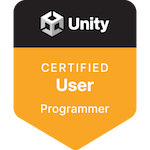
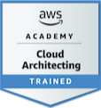

## Hi there, i'm Ivan 

- Programming student in Spain.
- Passionate about learning new technologies and programming languages.
- With great ease in learning and adapting to new languages.

---

### 📚 Languages
  
*Others: Visual Basic, AL, MarkDown, Xaml*

---

### ⚙️ Tools
  
*Others: Dev C++, MySQL Workbench, Business Central, Power BI, n8n, Oracle APEX*

---

### 🖥️ Operating Systems

---

### 🏆 Certifications

<a href="https://www.credly.com/users/donivanovich" target="_blank" style="text-decoration: none; outline: none; border: none;">
  

    
    
  

</a>

---

### 🌐 Connect with me
 
 
 

---

  

 

  

