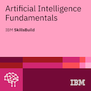
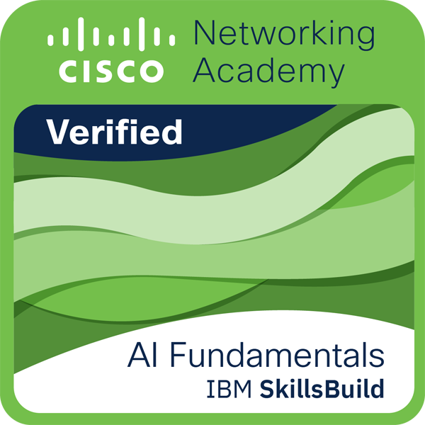
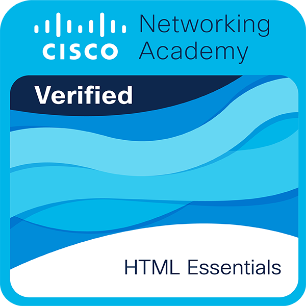
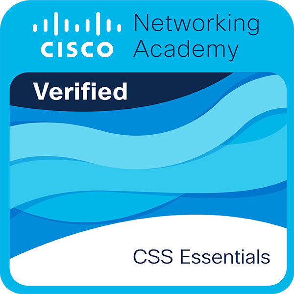
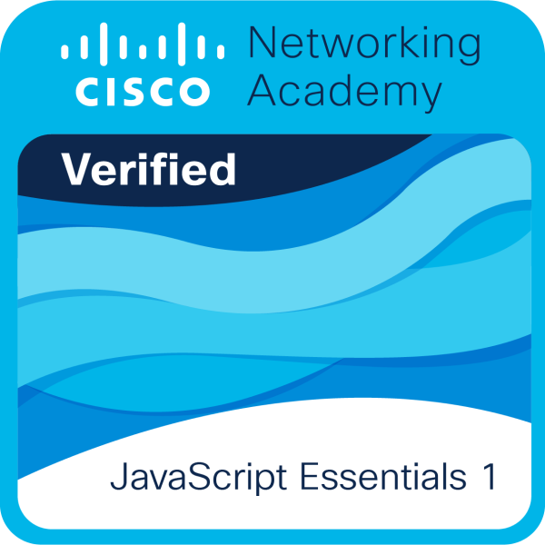
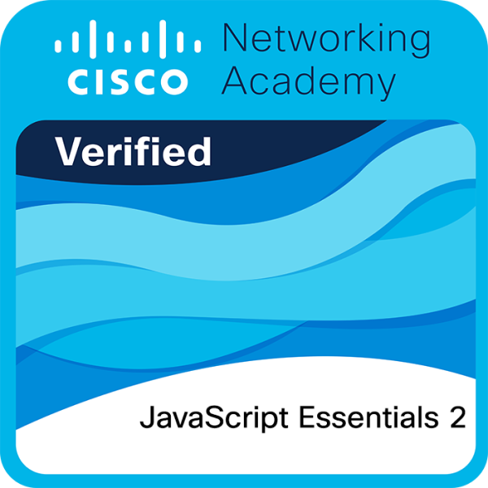
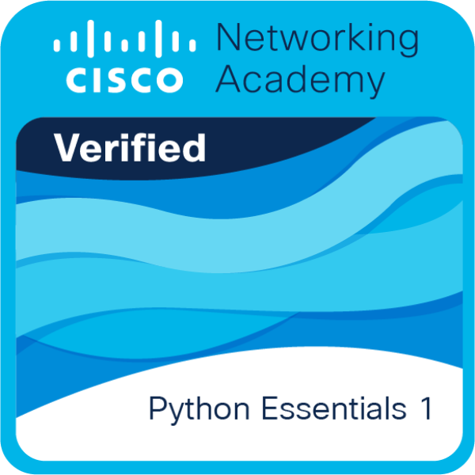
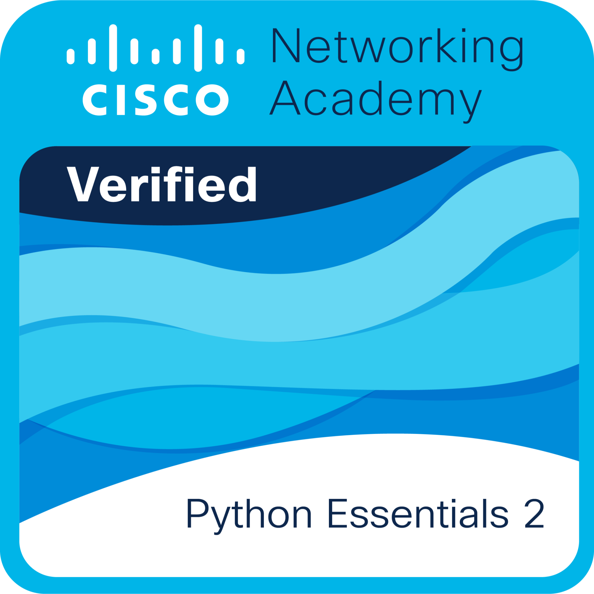

## Hi there, i'm Ivan 

- Programming student in Spain.
- Passionate about learning new technologies and programming languages.
- With great ease in learning and adapting to new languages.

---

### 🎨 Frontend
  

---

### 🔧 Backend
  

---

### ⚙️ Tools
  

---

### 🌍 Environments
  

---

### 🖥️ Operating Systems

---

<a href="https://www.credly.com/users/donivanovich"
   target="_blank"
   rel="noopener noreferrer"
   style="text-decoration: none; color: inherit; display: block; max-width: 900px; margin: 0 auto;">
  
  

    <h3 style="
      margin: 0 0 8px 0;
      font-family: Arial, sans-serif;
      font-size: 1.4rem;
      color: #1f2937;
      text-align: center;
    ">
      🏆 My Certifications & Badges
    </h3>
    

      View my verified credentials on Credly
    

    

      
      
      
      
      
      
      
      
      
      
      
      
      
      
      
      
    

  

</a>

---

### 🌐 Connect with me
 
 
 

---

  

 

  

